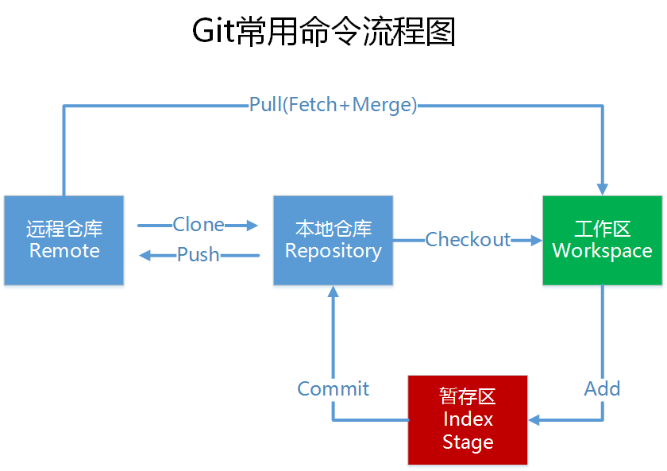
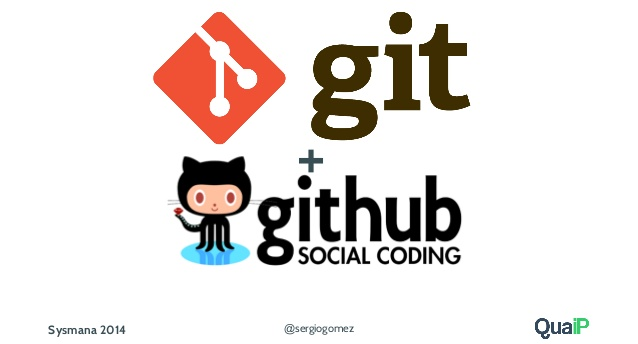
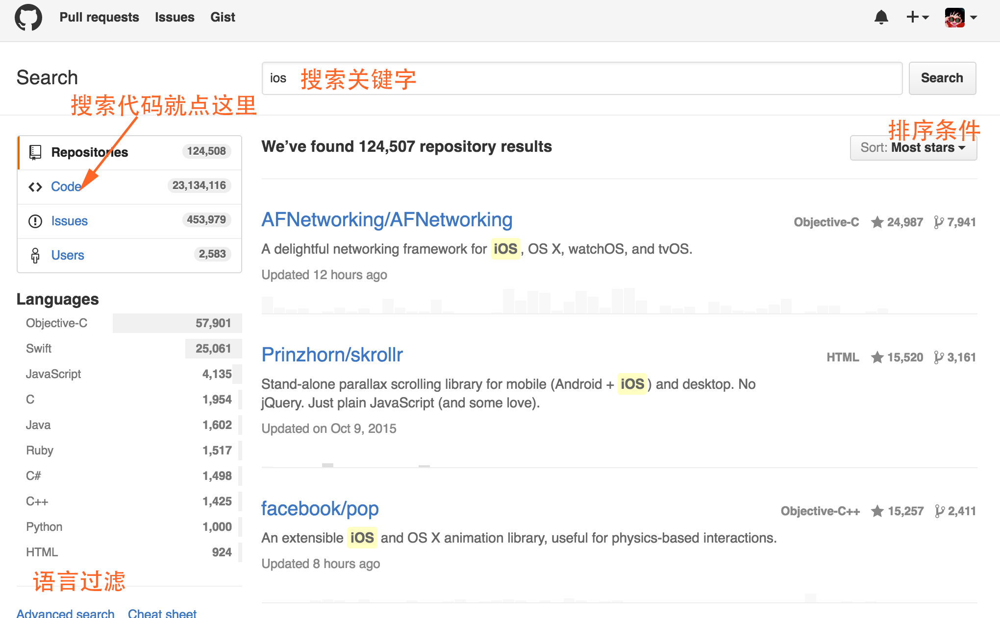

background-image: url(ai/begin.jpeg)
# git & GitHub

---
name: template
background-image: url(ai/bg.jpeg)
--
### git 
Torvalds quipped about the name git (which means "unpleasant person" in British English slang): "I'm an egotistical bastard, and I name all my projects after myself. First 'Linux', now 'git'." The man page describes Git as "the stupid content tracker". 
.right[[ Wikipedia ](https://en.wikipedia.org/wiki/Git_software)]

### GitHub
GitHub is a web-based Git repository hosting service 
.right[[ Wikipedia ](https://en.wikipedia.org/wiki/GitHub)]


???

托瓦兹

git 读音

经常有hr说：“把你的git帐号给我看一下”

---
template: template
### git 简史

```ruby
同生活中的许多伟大事物一样，git 诞生于一个极富纷争大举创新的年代。

Linux 内核开源项目有着为数众广的参与者。 绝大多数的 Linux 内核维护工作都花在了提交补丁和保存归档的繁琐事务上（1991－2002年间）。
到 2002 年，整个项目组开始启用一个专有的分布式版本控制系统 BitKeeper 来管理和维护代码。

到了 2005 年，开发 BitKeeper 的商业公司同 Linux 内核开源社区的合作关系结束，他们收回了 Linux 内核社区免费使用 BitKeeper 的权力。
这就迫使 Linux 开源社区（特别是 Linux 的缔造者 Linux Torvalds）基于使用 BitKcheper 时的经验教训，开发出自己的版本系统。 他们对新的系统制订了若干目标：

- 速度

- 简单的设计

- 对非线性开发模式的强力支持（允许成千上万个并行开发的分支）

- 完全分布式

- 有能力高效管理类似 Linux 内核一样的超大规模项目（速度和数据量）

自诞生于 2005 年以来，git 日臻成熟完善，在高度易用的同时，仍然保留着初期设定的目标。 它的速度飞快，极其适合管理大项目，有着令人难以置信的非线性分支管理系统
```

---
template: template
### git 安装

- Mac 自带git
- Windows [https://git-for-windows.github.io/](https://git-for-windows.github.io/)


---
template: template
### git 基本概念

#### 缓存 = stage (index, cache)
#### 提交 = commit (verb, noun)
#### 仓库 = repository (remote, local)
#### 标签 (里程碑) = tag 
#### 分支 = branch (diff with tag)

???

给稳定版创建一个分支，作为备份 ❌

tags  .git/refs/tags

http://gitready.com/advanced/2009/03/23/whats-inside-your-git-directory.html


---
template: template
name: git-struct
.center[]

???
改一下图
---
template: template
### git 常用命令

.columns[
* git add
* git archive
* **git bisect**
* git branch
* git checkout
* **git cherry-pick**
* git clean
* git clone
* git commit
* git diff
* git fetch
* git init
* git log
* git merge
* git pull
* git push
* **git rebase**
* **git reflog**
* **git reset**
* **git revert**
* **git stash**
* git status
* git tag
]

---
template: template
### git add

```ruby
git-add - Add file contents to the index
```

常见用法
```ruby
$ git add .         # 添加当前目录所有update 和untrack 的文件进入 index
$ git add -A        # 添加所有文件
$ git add -u        # 添加所有 update的文件
$ git add -i        # 交互式添加文件
$ git add "*.swift" # 添加后缀为 swift 的所有文件

```

---
template: template
### git archive

```ruby
git-archive - Create an archive of files from a named tree
```

常见用法
```ruby
$ git archive -o latest.zip HEAD
# 打包当前HEAD 指向的版本，常用于发布
```

---
template: template
### git bisect

```ruby
git-bisect - Use binary search to find the commit that introduced a bug
```

Demo

~/git-demo/bisect

---
template: template
### git branch

```ruby
git-branch - List, create, or delete branches
```

常见用法
```ruby
$ git branch -a
# 查看所有分支
$ git branch -d <branch-name>
# 安全删除分支
$ git branch -D <branch-name>
# 强制删除分支
```

---
template: template
### git checkout

```ruby
git-checkout - Switch branches or restore working tree files
```

```ruby
$ git checkout <commit>
$ git checkout <branch>
```

Demo next page

---

<iframe src="http://pcottle.github.io/learnGitBranching/?gist_level_id=e8aadd8d8b17c711d03f939b8bc1cbd6">

---
template: template
### git cherry-pick

```ruby
git-cherry-pick - Apply the changes introduced by some existing commits
```

Demo next page
---
template: template

<iframe src="http://pcottle.github.io/learnGitBranching/?gist_level_id=e8aadd8d8b17c711d03f939b8bc1cbd6">

???
git cherry-pick C3 C4 C7

---
template: template
### git clean
```ruby
git-clean - Remove untracked files from the working tree
```

常见用法
```ruby
$ git clean -fd
# 删除所有没有加入index 的文件
```

---
template: template
### git clone
```ruby
git-clone - Clone a repository into a new directory
```

常见用法
```ruby
$ git clone <repo-url>
$ git clone <repo-url> <folder-name>
# clone <repo-url> 进入 <folder-name> 文件夹
```

---
template: template
### git commit
```ruby
git-commit - Record changes to the repository
```

常见用法
```ruby
$ git commit --amend
# 修改上一次commit 和本次已经加入index的 合并
$ git commit -m '<commit-message>'
```


---
template: template
### git diff
```ruby
git-diff - Show changes between commits, commit and working tree, etc
```

常见用法
```ruby
$ git diff
# 比较 local 和 index 的区别
$ git diff --cached
# 比较 index 和 workspace 的区别
$ git diff HEAD^
# 比较 前一次commit 和 workspace 的区别
```

---
template: template
### git fetch
```ruby
git-fetch - Download objects and refs from another repository
```

常见用法
```ruby
$ git fetch origin
$ git fetch <remote-name>
```

---
template: template
### git init
```ruby
git-init - Create an empty Git repository or reinitialize an existing one
```

```ruby
$ git init
$ git init --bare
# 生成裸库，用于新建服务端仓库
```

---
template: template
### git log
```ruby
git-log - Show commit logs
```

```ruby
$ git log --author=<author-name>
# 查询<author-name> 的commit
$ git log --grep="<keyword>"
# 查询 commit 包含 <keyword>
```

---
template: template
### git merge
```ruby
git-merge - Join two or more development histories together
```

```ruby
       Assume the following history exists and the current branch is "master":

                     A---B---C topic
                    /
               D---E---F---G master

$ git merge topic

                     A---B---C topic
                    /         \
               D---E---F---G---H master
```


---
template: template
### git pull
```ruby
git-pull - Fetch from and integrate with another repository or a local branch
```

```ruby
$ git pull 
# 等效于
$ git fetch && git merge
```

---
template: template
### git push
```ruby
git-push - Update remote refs along with associated objects
```

```ruby
$ git push --all
# push 所有branch
$ git push --tags
# push 所有tag 
```
---
template: template
### git rebase

```ruby
git-rebase - Reapply commits on top of another base tip
```

```ruby
       Assume the following history exists and the current branch is "topic":

                     A---B---C topic
                    /
               D---E---F---G master


       From this point, the result of either of the following commands:

           git rebase master
           git rebase master topic

       would be:

                             A'--B'--C' topic
                            /
               D---E---F---G master
```


Demo next page
---
template: template
<iframe src="http://pcottle.github.io/learnGitBranching/?gist_level_id=b167c989b29baa280526f327d5ce46df">

???

git checkout -b bugFix

git commit

git checkout master

git commit

git checkout bugFix

git rebase master

---
template: template
### git reflog

```ruby
git-reflog - Manage reflog information
reflog is short for Reference log
```

```ruby
$ git reflog
```

result
```ruby
e591465 HEAD@{0}: commit: modified: _posts/2016-05-12-hello-github.md
8b99240 HEAD@{1}: checkout: moving from f7f7ac92fc7cb55e155ed402df7c61aa6a9d1038 to master
f7f7ac9 HEAD@{2}: checkout: moving from master to f7f7ac92fc7cb55e155ed402df7c61aa6a9d1038
8b99240 HEAD@{3}: commit: remove line
9e880a2 HEAD@{4}: commit: add line
f7f7ac9 HEAD@{5}: commit: modified: index.html
9242b82 HEAD@{6}: commit: zx
3b7f002 HEAD@{7}: commit: new file: 2016-05-12-hello-github.md
f840487 HEAD@{8}: clone: from git@github.com:git-demonstration/git-demonstration.github.io.git
```

---
template: template
### git reset

```ruby
$ git reset [--option] <commit>
```

```ruby
# 如果一个文件file 
# 在workspace 里面状态是A
# 在index 里面状态是B
# 在HEAD 里面状态是C
# 我们需要的target commit 里面file 状态是D
$ git reset [--option] target
# 结果如下
```

```ruby
          working index HEAD target         working index HEAD
           ----------------------------------------------------
            A       B     C    D     --soft   A       B     D
                                     --mixed  A       D     D
                                     --hard   D       D     D
# --mixed 和 不传option效果一样
```

---
template: template
### git revert
```ruby
git-revert - Revert some existing commits
```
Demo next page
---
template: template
<iframe src="http://pcottle.github.io/learnGitBranching/?gist_level_id=1f9ca4031a8db73bed093d2c44e382b7">

??? 

git reset HEAD~1

git checkout pushed

git revert HEAD

---
template: template
### git stash

```ruby
git-stash - Stash the changes in a dirty working directory away
```

```ruby
$ git stash
# 藏匿当前修改
$ git stash list
# stash 列表
$ git stash clear
# 清除 stash 列表
```
---
template: template
### git status

```ruby
git-status - Show the working tree status
```

```ruby
$ git status -s
# 简洁模式
```

---
template: template
### git tag

```ruby
git-tag - Create, list, delete or verify a tag object signed with GPG
```

```ruby
$ git tag [-l]
# 查看tag 列表
$ git show <tag-name>
# 查看tag 详情
$ git tag -a <tag-name> <commit>
# 补打tag
$ git push [origin] <tag-name>
# push tag 
$ git push [origin] --tags
```

---
template: template
class: middle, center
### 图书推荐

- [Pro Git](https://progit.org/)
- Git权威指南
- [专为设计师而写的GitHub快速入门教程](http://www.ui.cn/detail/20957.html)

### 交互式教程推荐
- [githug](https://github.com/Gazler/githug)
- [learnGitBranching](https://pcottle.github.io/learnGitBranching/?demo)

---
template: template
### GitHub
.center[]

---
template: template
### GitHub
* Introduction
* Search project
* Trending in open source
* Download
* Creat repository and delete repository
* **Github page**
* Gist
* Gitbook
* **Star and fork repository**
* **Create issue**
* **Pull request**
* Github wiki
* Github organization
* Cooperate with people 

---
template: template
### Introduction

GitHub是一个利用Git进行版本控制、专门用于存放软件代码与内容的共享虚拟主机服务。它由GitHub公司（曾称Logical Awesome）的开发者Chris Wanstrath、PJ Hyett和Tom Preston-Werner使用Ruby on Rails编写而成。

截止到2016年4月，GitHub已经有超过1400万注册用户和3500万代码仓库。事实上已经成为了世界上最大的代码存放网站和开源社区。
.right[[ Wikipedia ](https://en.wikipedia.org/wiki/GitHub)]

---
template: template
### Search project

如何在3500万代码库中找到我们想要的代码，学习一下或者是拿来主义，如何搜索代码下面我们就来看个例子🌰

[GitHub search ios](https://github.com/search?q=ios&ref=opensearch)

---
.full[.center[]]

???
orange color #ff6633

---
template: template
### Trending in open source

如果不知道要搜索什么，就只想随便看看最近流行什么

世界那么大，我想随便看看 **[https://github.com/trending](https://github.com/trending)**
---
template: template
### Download code

- clone 仓库
- 下载所有代码
- 下载一部分代码 [gitzip](bumaociyuan.github.io/gitzip)
-
---
template: template
### Creat repository and delete repository
如何新建仓库，删除仓库
### Star and fork repository , update fork
### Create issue
### Send pull request
### Merge pull request

Demo

http://bumaociyuan.github.io/keynote
https://github.com/bumaociyuan/keynote


---
template: template
### **Github page**
- Personal blog http://bumaociyuan.github.io 
- Project github page http://bumaociyuan.github.io/gitzip

.center[## Demo 搭建一个GitHub Page 的个人 blog]

* Fork [https://github.com/mojombo/mojombo.github.io](https://github.com/mojombo/mojombo.github.io)
* 重命名仓库 `git-demonstration.github.io`
* 删除 `_post` 中所有的文件
* 写下第一篇 blog
* 删除 `index.html` 中无用的tag
* 删除 `CNAME`
* 稍等片刻访问 [git-demonstration.github.io](http://git-demonstration.github.io)

---
template: template
### Gist ( GFWed )
GitHub 提供的在线代码片段管理服务
[https://gist.github.com/](https://gist.github.com/)

---
template: template
### Gitbook

GitBook is where you create, write and organize documentation and books with your team.

[https://www.gitbook.com/](https://www.gitbook.com)


---
template: template
### Github wiki

Every GitHub repository comes equipped with a section for hosting documentation, called a wiki.

[iOS-style-guide wiki](https://github.com/asiainfomobile/iOS-style-guide/wiki/Xcode)
---
template: template
### Github organization

[AsiaInfo](https://github.com/asiainfomobile)

---
template: template
### Cooperate with people ( organization or add people to collaboration )

https://github.com/username/repo/settings/collaboration

---
template: template
### Setup git server
* On linux [git-scm](https://git-scm.com/book/en/v2/Git-on-the-Server-Setting-Up-the-Server)
* private repository ( free private repository: bitbucket, git on 360 driver )

Quick demo setup a git on server

???
ssh root@10.5.1.249

---
background-image: url(ai/end.jpeg)
class: top, center

